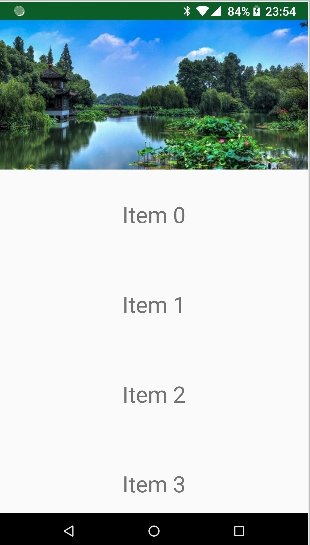

## I. Introduction
Recently I have been working one of my personal app : SixMall. I wrote a "OneAdapterForBinding" for the RecyclerView, which works fine. However I knew there is a similar library called "Epoxy" which is made by Airbnb. So I decided to look into the Epoxy library a bit, to see if there is something that I can take advantage of.

However, with respect to Airbnb, the Epoxy sample is quite a mess for a developer who never uses Epoxy before. It takes you quite a lot to time to understand the sample because it requires you know and understand Litho, lottie, data-binding, ... 

We know, sometimes, you don't use data-binding, or Litho. Most of time, you don't use Litho. Litho is a UI rendering framework made by Facebook. To tell the truth, I don't see any other companies is using Litho. So the high standard of this sample makes it very hard to grasp. And that's why I write this post. I want to show you a couple of simple examples of Epoxy, to help you understand this great library.

## II. Hello Workd -- Epoxy

### 1. The Paint Point of RecyclerView
First of all, we need to know what's the pain point of existing RecyclerView. 

1). You need to write an Adapter for each RecyclerView. It contains quite a lot boilerplate.
(p.s.  I wrote a **[OneAdapter](https://github.com/songzhw/SixUiViews/blob/master/app/src/main/java/cn/six/open/view/rv/OneAdapter/OneAdapter.java)** to fix this problem. You can use this `OneAdapter` for every RecyclerView)

2). If one RecyclerView has many item tyeps, then you need to write a lot of ugly `if/else` chain in the Adapter code.

3). Every time you remove or add one item type, you need to modify the Adapter, and to be careful to make the existing logic failed.  This is definitely violate the Open/Close Principle.

So my **[OneAdapter](https://github.com/songzhw/SixUiViews/blob/master/app/src/main/java/cn/six/open/view/rv/OneAdapter/OneAdapter.java)**, and Airbnb's **[Epoxy](https://github.com/airbnb/epoxy)**, are both trying to fix this by using "composition", rather than "inheritance".

### 2. What's Epoxy?

### 3. A Sample
What we will achieve is a RecyclerView that looks like: 

