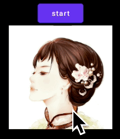

This is the final work of this animation.



This animation seems simple as it only change the shape of our ImageView. But Android does not provide a shape animation API for us to do so. This means we have to define this animation by ourselves.

# key point
The key point of this animation is to draw the rect and the circle out first, and how to transform from one to another. 

Here we use `canvas.clipPath(path)`, the `path` here is a circle. But when the view is rectangle, then the radius of the circle is `max(width, height)`, this way, we would see the whole rectangle.
When the view is circle, the radius changed to `min(width, height) / 2.0`. 

```kotlin
   var isCircle = false 

    override fun onSizeChanged(w: Int, h: Int, oldw: Int, oldh: Int) {
        super.onSizeChanged(w, h, oldw, oldh)
        radius = max(width, height).toFloat()
        resetPaths()
        initAnimation()
    }

    override fun onDraw(canvas: Canvas) {
        canvas.clipPath(clipPath)
        super.onDraw(canvas) // image view draw the pictures
    }

    // = = = = = = = = = = = private func = = = = = = = = = = =
    private fun resetPaths() {
        val cx = width / 2f
        val cy = height / 2f 
        clipPath.reset()
        clipPath.addCircle(cx, cy, radius, Path.Direction.CW)
    }

```

# make the animation

The key of animation lies in the `clipPath`. This path is adding a circile in it. We can just animate the radius of this circle, then we can get a rect or a circle. 

```kotlin
    // @JVMField: instruct Kotlin compiler not to generate getters/setters for this prop
    @JvmField var radius = 100f

    lateinit var anim: ObjectAnimator

    // ObjectAnimation will need this setter method
    fun setRadius(r: Float) {
        this.radius = r
        resetPaths()
        invalidate()
    }    

    // onSizeChanged will call this initAnimation
    private fun initAnimation() {
        val from = max(width, height).toFloat() // since the radius is big enough, so the whole view (rectangle) will just show
        val to = min(width, height) / 2.5f   // show a circle
        anim = ObjectAnimator.ofFloat(this, "radius", from, to)
        anim.interpolator = AccelerateDecelerateInterpolator()
        anim.duration = 1000
        anim.addListener(object : AnimatorListenerAdapter() {
            override fun onAnimationEnd(animation: Animator) {
                isCircle = !isCircle
                println("szw anim end. now isCircle = $isCircle")
            }
        })
    }

```

Okay, then calling `anim.start()` or `anim.reverse()` will make a shape animation from square to circle, and vice versa. 


# conclusion
The key of this is to make a path, and doing animation based on this path. 
This is one solution to make a shape animation. 