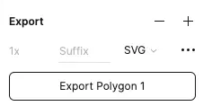
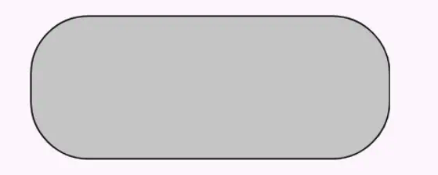
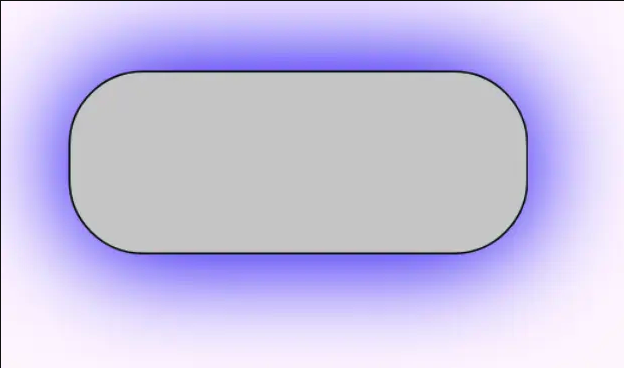

# I. Theory
If your UX are a fan of shadow, then you will find your effort to achieve a perfect shadow is quite miseralbe. That's mostly because Android is using a different theory of shadow. 

The most common theory about shadow is using `offsetX, offsetY, blur, spread, color, alpha`. This is is widely used by iOS, Html/CSS, and figma.  This is a picture of how to design a shadow in figma. 


```css
/* web can use:  */
filter: drop-shadow(5px 5px 5px rgba(0,0,0,0.3));
```


```swift
// iOS can use:
let yourView = UIView()
yourView.layer.shadowColor = UIColor.black.cgColor
yourView.layer.shadowOpacity = 1
yourView.layer.shadowOffset = .zero
yourView.layer.shadowRadius = 10
```

But back to Android, Android's shadow is more like a use case in real life. You have a candle far away, and the light will make the object away from the candel to show the shadow on the wall.  
Apparently, the more close your object is, the big and light the shadow is on the wall:


p.s. the `elevation` attribute of a View is like the distance between our view to the candel, the light source. 
If your `elevation = 0dp`, that means you object is directly on the wall, so no shadow at all. 

Also Android make the shadows as two types:

* The red part is called `ambient shadow`
* The blue part is called `spot shadow`. 

# II. Android Theory
Android is providing 5 attributes to set the shadow, and they have different `minSDK` requirement:

| since when?  | attr name          | whose attr? |
|--------------|--------------------|-------------|
| since API 21 | elevation          | View        |
|              | spotShadowAlpha    | theme       |
|              | ambientShadowAlpha | them        |
| sine API 28  | spotShadowColor    | View        |
|              | ambientShadowColor | View        |

But even you set all the these 5 attributes, you will be very likey find out there is no shadow at all. Why? 

# III. Pitfalls of Shadow on Android

We said this before, 'Just like a far-awary light and cast the light to your view, then we have shadow', To be more accurate, this saying is not 100% true. Because the shadow is not generated by the color, and it is more like generated by the view's backgroud. 

## pitfall 1: you need a elevation
As we said before, if no elevation, it's just like your view is on the wall directly, so no shaodw on the wall at all. 

## pitfall 2: you need a bg
If you are curious why you set `android:elevation = 32dp` and there is no shadow at all. It's most likely that your view does not have a background. The code below can generate a shadow for you, in general. 

```xml
<SomeView
	android:background="@drawable/some_bg"
	android:elevation="24dp"
	/>
```


## pitfall 3: the bg can't be a svg bg
The reason why we say 'in general' is it's not 100% working all the time. It has a precondition, that your bg is a color, a png, or a `<shape>` bg. The only thing that does not work is a SVG bg. If your bg is a `<vector>` then you wouldn't have a shadow as well.



## pitfall 4: Do I need more extra space for shadow?
No, you don't have to. Android will take care of shadow. That's to say, if your view is 100dp width and 100dp height, and your shadow are like 50x50, you don't have to make your view as 150x150.  100x100 is enough for us. 

# IV. Best Practice

Take one real-life feautre for example. This is a grey button: 

Now I need to add a blue shadow on it. Here is what we do: 

## step 1. theme
we set the alpha of two types of shadow to `1` and it will be more clear to see the shadow we set in the view. 

Of course, there are two values folder for the shadow due to the API requirement. 

```xml
// res/values/themes.xml
<style name="MyTheme" parent="BaseTheme">
    <item name="android:ambientShadowAlpha">0.05</item>
    <item name="android:spotShadowAlpha">0</item>
</style>

```

and some API is coined since Android 9+, so we have to declare it in teh values-v28 folder as well:

```xml
// res/values-v28/themes.xml
<style name="MyTheme" parent="BaseTheme">
      <item name="android:ambientShadowAlpha">1</item>
      <item name="android:outlineAmbientShadowColor">#cccccc</item>
      <item name="android:spotShadowAlpha">0</item>
  </style>
```

## step 2. add a non-svg backgorund to the view

Now the button should have such a background drawable: 

```xml
// res/drawable/bg_grey_round_corner.xml

<?xml version="1.0" encoding="utf-8"?>
<shape xmlns:android="http://schemas.android.com/apk/res/android">
    <solid android:color="#ccc"/>
    <corners android:radius="40dp"/>
    <stroke android:color="#000" android:width="1dp"/>
</shape>
```

## step 3. add elevation and shadow color to the view
```xml
    <Button 
        android:layout_height="100dp" android:layout_width="250dp"
        android:background="@drawable/bg_grey_round_corner"
        android:outlineAmbientShadowColor="#00f"
        android:elevation="74dp"
        />

```

## step 4. (optional) may have to add padding to its parent
If sometimes the shadow is cut off, you can add a parent with padding, and also add a `clipToPadding`, then the shadow will be normal again.

```xml
<FrameLayout android:padding="20dp" 
    android:clipTpPadding="false"> 

       <Button 
        android:layout_height="100dp" android:layout_width="250dp"
        android:background="@drawable/bg_grey_round_corner"
        android:outlineAmbientShadowColor="#00f"
        android:elevation="74dp"
        />
```

## step 5. the final result

