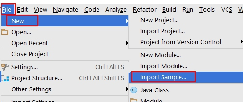
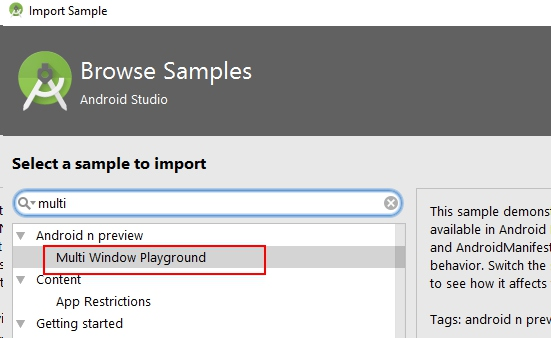

As the most amazing feature of Android 7.x, split screen really can be powerful in sometimes. You may see the list and the details at the same time. Split screen may improve your productivity when you are using your phone.

Today I will introduce the details about the split screen in Android 7.x.

### 1. How to support split screen
You can set `android:resizeableActivity` property to <activity> or <application> node, then your app can support split screen.

P.S. If the root activity of your task is `android:resizeableActivity="true"`, then the task stack all Activity will be resizeable!
(In this case, you need to know whether to add the "FLAG_ACTIVITY_NEW_TASK" or not to the Intent.)

### 2. new APIs
You can use `Activity.isInMultiWindowMode()` to confirm Activity is in multi-window mode.
( Of course, this method is since API Level 24(Android 7.0). )

And you can use `onMultiWindowModeChanged(boolean isInMultiWindowMode)` to know the timing when the activity changes from fullscreen mode to multi-window mode and visa-versa.

### 5. What should we do to support Split Screen?
There is a trick: You only have to support sw320dp, so you can expand your app to Split Screen. 

### 4. Life Cycler

### 5. Minefield
#### 5.1 <layout>'s minimalWidth

#### 5.2 orientation

### 6. Drag & Drop

### 7. Split Screen & Espresso

### Samples Code
1. Here is [the sample code](https://github.com/googlesamples/android-MultiWindowPlayground).

2. You can also import this sample project from Android Studio. Here is how you do it:

Then search for "multi window", and you will get the result:

